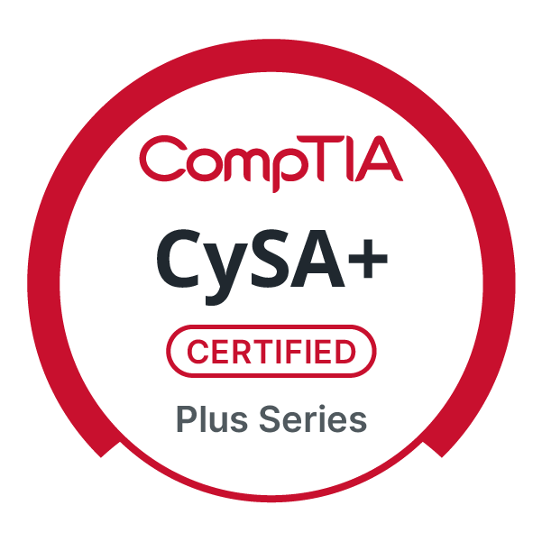
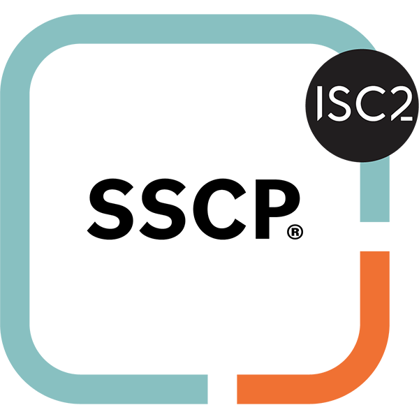
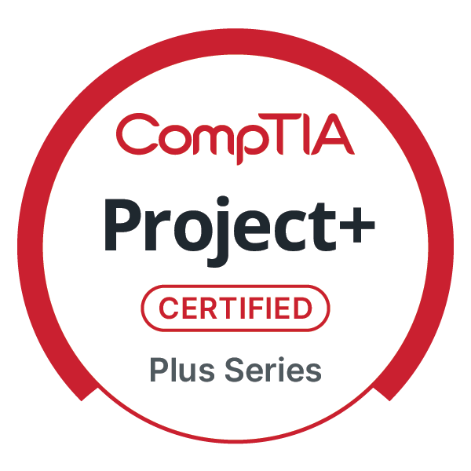
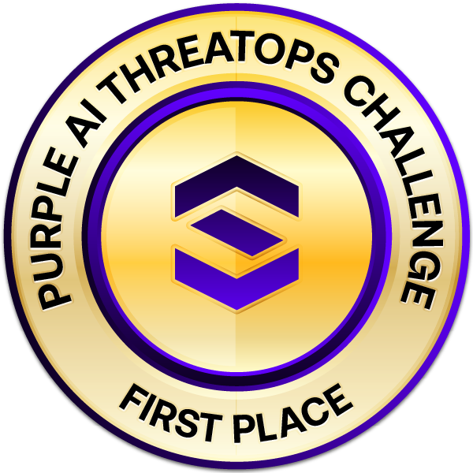
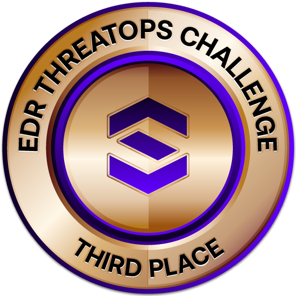

# 👋-Welcome to My Portfolio! 

## About Me  
I’m a cybersecurity professional with hands-on experience supporting enterprise SOC operations for a large public-sector organization. I work daily with SIEM, EDR, and network security tools to detect threats, analyze phishing campaigns, correlate indicators of compromise, and support incident response across thousands of endpoints and users.

My background combines formal cybersecurity education with real-world defensive operations, including threat hunting, log analysis, security automation, and endpoint hardening aligned with CIS and CJIS standards. I enjoy turning raw security data into actionable insights—whether that’s through Splunk dashboards, PowerShell automation, or improving detection and response workflows.

I’m actively building and documenting projects in my GitHub portfolio to demonstrate practical security skills, continuous learning, and a strong blue-team mindset, with a focus on SOC operations, incident response, and cyber defense.

--- 

## 🎓 Education

### Bachelor of Science in Cybersecurity & Information Assurance *(In Progress)*
**Western Governors University — Salt Lake City, UT**  
**Expected Graduation:** May 2026  

Focused on defensive security, incident response, and cloud security. Coursework emphasizes Linux administration, cryptography, network defense, security governance, and hands-on cyber defense aligned with CySA+ and PenTest+ domains.

### Associate of Science in Cybersecurity
**Pasadena City College — Pasadena, CA**  
**Graduated:** December 2024 | **GPA:** 3.6  

Completed extensive hands-on labs in ethical hacking, digital forensics, Windows and Linux administration, enterprise networking, Python scripting, and SQL.  
Earned Certificates of Achievement in Cybersecurity, Systems & Network Administration, and Help Desk.

### Department of Homeland Security (DHS) — Cybersecurity Analyst Seminar
**Completed:** January 2026  

Completed DHS-aligned cybersecurity training focused on federal threat detection, risk analysis, and incident response. Topics included network protocol analysis (TCP/IP, SMB), phishing and social engineering attacks, malware analysis, MITRE ATT&CK TTP identification, and core security principles (CIA triad).

---

## 📜 Certifications & Competitions

### Certifications
- GIAC Security Essentials (GSEC)
- ISC2 SSCP
- CompTIA Network+
- CompTIA A+
- LPI Linux Essentials
- CompTIA Project+
- CompTIA CySA+ *(Expected January 2026)*

### Competitions
- **SentinelOne Purple AI ThreatOps Challenge** — 🥇 1st Place  
- **SentinelOne EDR ThreatOps Challenge** — 🥉 3rd Place

   <!-- Closing the first <a> tag -->

   <!-- Closing the first <a> tag -->
  
   <!-- Closing the first <a> tag -->

 <!-- Closing the second <a> tag -->
  
   <!-- Closing the second <a> tag -->

   <!-- Closing the second <a> tag -->

   <!-- Closing the second <a> tag -->
  

 <!-- COMPETITIONS -->  

 

   <!-- Closing the third <a> tag -->
  
   <!-- Closing the third <a> tag -->

---

# 💻 Showcasing my Homelab and Projects
## [🔎-Splunk Detection Queries](./projects/Splunk/Splunk-Library.html)
## [🌐-Network Lab](./projects/network-lab.html)
## [More Coming Soon]()

---

<h2>🧠 Technical Skills</h2>

<table style="width: 100%; border-collapse: collapse; text-align: left; margin-bottom: 20px;">
  <thead>
    <tr>
      <th style="padding: 12px; border: 1px solid #ddd;">🔐 Security Domains</th>
      <th style="padding: 12px; border: 1px solid #ddd;">⚙️ Tools, Platforms & Technologies</th>
    </tr>
  </thead>
  <tbody>
    <tr>
      <td style="padding: 12px; border: 1px solid #ddd;">🖥️ Operating Systems</td>
      <td style="padding: 12px; border: 1px solid #ddd;">Windows 10/11, Linux, macOS, Chrome OS</td>
    </tr>
    <tr>
      <td style="padding: 12px; border: 1px solid #ddd;">👤 Identity & Access Management (IAM)</td>
      <td style="padding: 12px; border: 1px solid #ddd;">Active Directory, Azure AD, Conditional Access, PowerShell</td>
    </tr>
    <tr>
      <td style="padding: 12px; border: 1px solid #ddd;">🛡️ Endpoint Detection & Response (EDR)</td>
      <td style="padding: 12px; border: 1px solid #ddd;">SentinelOne, Carbon Black, Malwarebytes Nebula</td>
    </tr>
    <tr>
      <td style="padding: 12px; border: 1px solid #ddd;">📊 SIEM & Security Monitoring</td>
      <td style="padding: 12px; border: 1px solid #ddd;">Splunk, Microsoft Defender, Proofpoint TRAP</td>
    </tr>
    <tr>
      <td style="padding: 12px; border: 1px solid #ddd;">🚨 Incident Response & Malware Analysis</td>
      <td style="padding: 12px; border: 1px solid #ddd;">ANY.RUN, VirusTotal, Hybrid Analysis, Joe Sandbox, Intezer Analyze</td>
    </tr>
    <tr>
      <td style="padding: 12px; border: 1px solid #ddd;">📬 Email & Phishing Analysis</td>
      <td style="padding: 12px; border: 1px solid #ddd;">MXToolbox, MailHeader Analyzer, DNSChecker, Proofpoint Awareness</td>
    </tr>
    <tr>
      <td style="padding: 12px; border: 1px solid #ddd;">🔎 Threat Intelligence & OSINT</td>
      <td style="padding: 12px; border: 1px solid #ddd;">MITRE ATT&CK, Cisco Talos, SANS ISC, Threat Connect</td>
    </tr>
    <tr>
      <td style="padding: 12px; border: 1px solid #ddd;">🌐 Network & Protocol Analysis</td>
      <td style="padding: 12px; border: 1px solid #ddd;">Wireshark, Nmap, Tcpdump</td>
    </tr>
    <tr>
      <td style="padding: 12px; border: 1px solid #ddd;">🕵️ OSINT & Exposure Discovery</td>
      <td style="padding: 12px; border: 1px solid #ddd;">Shodan, Have I Been Pwned, DomainTools, WHOIS, MXToolbox</td>
    </tr>
    <tr>
      <td style="padding: 12px; border: 1px solid #ddd;">🧱 Hardening, Baselines & Compliance</td>
      <td style="padding: 12px; border: 1px solid #ddd;">CIS Benchmarks, Windows Security Baselines, CJIS Compliance</td>
    </tr>
    <tr>
      <td style="padding: 12px; border: 1px solid #ddd;">⚙️ Automation & Scripting</td>
      <td style="padding: 12px; border: 1px solid #ddd;">PowerShell, Intune, SQL</td>
    </tr>
    <tr>
      <td style="padding: 12px; border: 1px solid #ddd;">📡 Network & Endpoint Management</td>
      <td style="padding: 12px; border: 1px solid #ddd;">Intune, SentinelOne Dynamic Groups</td>
    </tr>
    <tr>
      <td style="padding: 12px; border: 1px solid #ddd;">📈 Dashboards & Reporting</td>
      <td style="padding: 12px; border: 1px solid #ddd;">Splunk Custom Dashboards, SentinelOne Policy Matrix, Excel, SharePoint</td>
    </tr>
    <tr>
      <td style="padding: 12px; border: 1px solid #ddd;">🔐 Account & Credential Security</td>
      <td style="padding: 12px; border: 1px solid #ddd;">Active Directory Audits, On-Prem Password Manager</td>
    </tr>
  </tbody>
</table>

---

## 🧠 Soft Skills

- Communicate security findings clearly to both technical teams and non-technical stakeholders through reports, dashboards, and briefings  
- Apply critical thinking and analytical reasoning to investigate alerts, assess risk, and support incident response decisions  
- Maintain strong attention to detail when documenting incidents, validating indicators, and following security procedures  
- Manage time effectively while triaging multiple alerts and meeting response deadlines in high-pressure environments  
- Adapt quickly to evolving threats, tools, and workflows in fast-paced IT and SOC operations  
- Collaborate across SOC, IT, and security teams to resolve incidents and improve defensive posture  
- Self-driven learner who continuously improves technical skills through labs, certifications, and real-world practice  
- Demonstrate leadership and initiative by contributing to security awareness efforts, process improvements, and small-scale projects  

---
